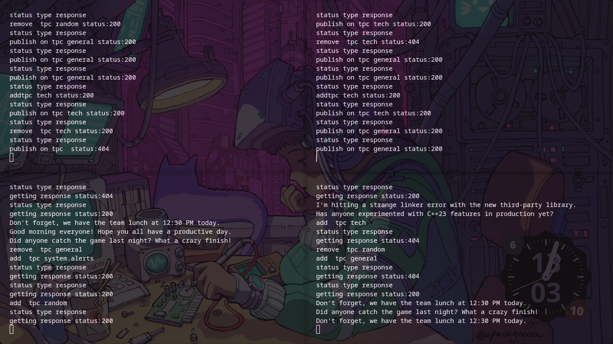

# File Watcher

Linux C++ Publisher-Subscriber system based on a single-threaded, non-blocking, edge triggered epoll event loop. Currently implemented using file/folder watchers as publishers, supports standard different publisher/subscriber types.

Highlights

- Publish-Subscribe Architecture - enables publishers to be separated from subscribers and to have many subscribers to a single publisher.
- File/Folder Publisher - listens for filesystem activity and publishes events.
- Subscriber Support – intended for user/client subscribers that subscribe to have events delivered from publishers.
- Pub-Sub SDK to build external project with .
- Event-Driven Read Operations - Event-driven Read Operations. Use non-blocking file descriptors with epoll to process several clients from 1 thread.
EPOLL - 21 - 7.8 The epoll API Edge-Triggered epoll - uses EPOLLET for event-driven processing.
- Event Handling: The call to epollManager.runEventLoop() returns the handle(s) to which the event was sent.
- Work with multiple Clients - supports more than one client using single server Thread.
- Independent Command Server - separates the handling of command from the event-processing layer.
-  Resource Management - manages client lifecycle and cleanup, events such as EPOLLRDHUP and EPOLLERR.


### Run Example
Cmake Generate -``` cmake -S . -B build -G Ninja ``` 
Compile executables - ``` Ninja -C build ```
run these executables
 - for server -- ./build/server/PubSub
 - for automatic pub and sub client examples - ```./build/examples/pubMult ``` and ``` ./build/examples/subMult ``` 
 - for interactive pub and sub client examples - ```./build/examples/pub ``` and  ``` ./build/examples/sub ``` 
 - for fileEventServer server -- ./build/server/FileEventSystem
 - fileEvent server SDK not built Yet(remaining)
 - run all example in one ``` ./unifiedExample.sh ```(use tmux otherwise everything run in same screen)
 
